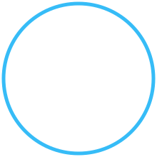

15kb.jpg
# Hi there 👋, I'm Prem Gudavalli

### 🚀 Full-Stack Developer | 🎓 MCA Student | 🐍 Python Enthusiast | 💻 Web Developer

  

---

## 👨‍💻 About Me

🎓 I'm currently pursuing **MCA at KL University**.

💻 I'm passionate about **Full-Stack Web Development** and building real-world applications.

🐍 I enjoy working with **Python, JavaScript, React, and backend technologies**.

🌐 I'm interested in creating **responsive, user-friendly, and scalable web applications**.

🌱 Currently improving my skills in **Data Structures & Algorithms, Backend Development, Databases, DevOps, and AI/ML**.

🚀 I believe in learning by building and continuously improving my technical skills.

---

## 🚀 What I'm Currently Working On

- 🍔 **Food Delivery Application** — Building a full-stack food ordering application.
- 📝 **Simple Notes Management System** — Managing and organizing notes through a web application.
- 🛒 **College OLX** — A marketplace platform designed for college students.
- 🤖 **AI & Machine Learning** — Exploring AI/ML concepts and intelligent applications.
- ⚙️ **DevOps** — Learning Git, GitHub, Jenkins, and deployment.

---

## 🛠️ Tech Stack

### 💻 Languages

### ⚛️ Frontend

### ⚙️ Backend

### 🗄️ Database

### 🧰 Tools

---

## 🌟 Featured Projects

### 🍔 Food Delivery Application

A full-stack food delivery application focused on providing a smooth and user-friendly food ordering experience.

**Technologies:** React • JavaScript • Node.js • Express.js • MongoDB

---

### 📝 Simple Notes Management System

A simple application for creating, viewing, updating, and deleting notes.

**Technologies:** Python • HTML • CSS • JavaScript • Database

---

### 🛒 College OLX

A marketplace application designed for college students to list, browse, and manage products.

**Technologies:** HTML • CSS • JavaScript • Backend • Database

---

## 📊 GitHub Stats

  
  

---

## 🔥 GitHub Streak

  

---

## 📚 Currently Learning

text
🐍 Python
⚛️ React
🌐 Full-Stack Development
🗄️ MongoDB & MySQL
🔗 REST APIs
⚙️ DevOps & Jenkins
🤖 AI & Machine Learning
🧠 Data Structures & Algorithms
 add my image to show there and the image path is "C:\Users\Asus\Pictures\15kb.jpg" andd also im uploading image here

Absolutely 👍 Since you uploaded 15kb.jpg, you can show it in your GitHub README.

Important:
C:\Users\Asus\Pictures\15kb.jpg will not work on GitHub, because that's only your computer's local path. You need to upload the image into your GitHub repository.

Recommended setup
Put the image in your repository like this:

your-repository/
├── README.md
└── assets/
    └── 15kb.jpg
Then add this right below your main heading:

# Hi there 👋, I'm Prem Gudavalli

  

### 🚀 Full-Stack Developer | 🎓 MCA Student | 🐍 Python Enthusiast | 💻 Web Developer
Or, for a more professional profile look
I recommend this:

# Hi there 👋, I'm Prem Gudavalli

  

  <strong>🚀 Full-Stack Developer | 🎓 MCA Student | 🐍 Python Enthusiast | 💻 Web Developer</strong>

  

Your GitHub profile will then look roughly like:

Hi there 👋, I'm Prem Gudavalli

🖼️ Your uploaded photo

🚀 Full-Stack Developer | 🎓 MCA Student | 🐍 Python Enthusiast | 💻 Web Developer

Full-Stack Developer → Python | JavaScript | React → Building Real-World Projects ...

📌 How to upload the image
Open your GitHub repository.

Click Add file → Upload files.

Create an assets folder if you don't already have one.

Upload your 15kb.jpg.

Make sure the path is:

assets/15kb.jpg
Put the README code above in README.md.

Commit the changes.

Don't put C:\Users\Asus\Pictures\15kb.jpg in the README. Use ./assets/15kb.jpg.

If you want, I can also redesign your entire GitHub README into a modern, professional developer portfolio with your photo, animated sections, skills, project cards, GitHub stats, social links, and a clean layout.

a6205165-0c0a-49df-958b-f921e60a0f05.png

a97df9e1-d847-4a51-8d91-47af3601dc3f.png
main repositirylo ela add chryyali photo 

e3f1e4c2-21cc-46e7-96b9-382fb881115c.png

cc5ab3fb-d77d-48da-b1ac-de762fcd4086.png
raledu ]

Avunu, ardham ayyindi 👍 CSS code work avvaledu. GitHub README lo style="border-radius:50%" ni ignore chestundi.

JPG ni PNG ga convert cheyyakunda circle kavali ante, oka SVG wrapper use cheddam. Nee original 15kb.jpg alane untundi.

1. Repository lo profile-circle.svg create cheyyi
+ → Create new file

Filename:

profile-circle.svg
Inside this code paste cheyyi:

Then Commit changes.

2. README lo old photo code remove chesi idi pettu

  

Result
        ╭──────────╮
      ╭─            ─╮
     │    YOUR PHOTO   │
     │      👤         │
      ╰─            ─╯
        ╰──────────╯
So 15kb.jpg original JPG gaane repository lo untundi. PNG conversion avasaram ledu. ✅

If you want, nee current README beginning ni exactly copy-paste cheyyadaniki ready version kuda istaanu.

created a file which code shpuld i paste in it 

Yes 👍 If the file you created is named profile-circle.svg, paste exactly this into it:

<svg width="220" height="220" viewBox="0 0 220 220" xmlns="http://www.w3.org/2000/svg">
  <defs>
    <clipPath id="circle">
      <circle cx="110" cy="110" r="105"/>
    </clipPath>
  </defs>

  <image
    href="./15kb.jpg"
    x="5"
    y="5"
    width="210"
    height="210"
    preserveAspectRatio="xMidYMid slice"
    clip-path="url(#circle)"
  />

  <circle
    cx="110"
    cy="110"
    r="105"
    fill="none"
    stroke="#36BCF7"
    stroke-width="5"
  />
</svg>
Then:

1. Click Commit changes... ✅

2. Open README.md → Edit

3. Remove your current photo code:

  

4. Replace it with:

  

5. Commit changes.

⚠️ Make sure the repository has these three files at the same level:

README.md
15kb.jpg
profile-circle.svg
If you've already created the file and you're currently on the Create new file screen, just paste the SVG code above into the big editor.

na pic raledu svg code lo 

Avunu 👍 SVG lo pic raakapovadaniki reason href="./15kb.jpg" GitHub SVG lo work avvakapovadam. My previous code lo adi problem.

Nee original JPG ni convert cheyyakunda first absolute GitHub URL try cheddam.

profile-circle.svg lo entire code delete chesi idi paste cheyyi:
<svg width="220" height="220" viewBox="0 0 220 220" xmlns="http://www.w3.org/2000/svg">
  <defs>
    <clipPath id="circleClip">
      <circle cx="110" cy="110" r="105"/>
    </clipPath>
  </defs>

  <image
    href="https://raw.githubusercontent.com/premgudavalli20/premgudavalli20/main/15kb.jpg"
    x="5"
    y="5"
    width="210"
    height="210"
    preserveAspectRatio="xMidYMid slice"
    clip-path="url(#circleClip)"
  />

  <circle
    cx="110"
    cy="110"
    r="105"
    fill="none"
    stroke="#36BCF7"
    stroke-width="5"
  />
</svg>
Then Commit changes.

README lo:

  

